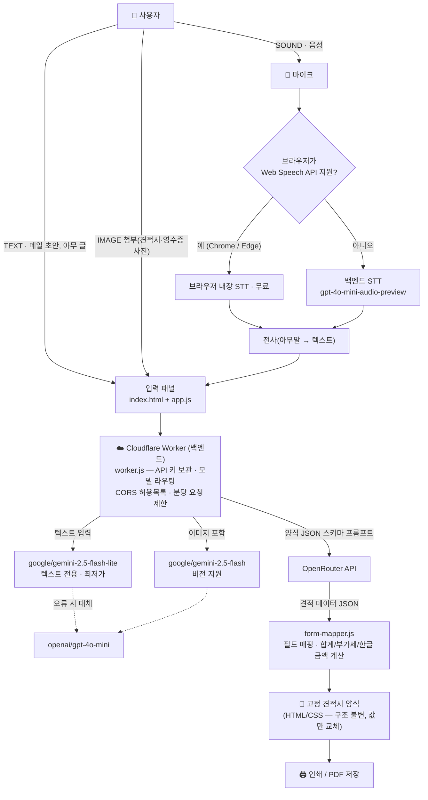

# 견적서 자동입력 AI (autodocs)

아무 글이나 음성을 전달하면 AI가 **고정된 견적서 양식**에 값을 채워 주는 웹앱입니다.

- 프론트엔드: **HTML / CSS / JS** 정적 웹앱 (GitHub Pages 등 정적 호스팅)
- 백엔드: **Cloudflare Worker** — OpenRouter API 키를 서버에 숨겨 보관, **사용자는 API 키를 입력할 필요가 없습니다**
- 파이썬 · 별도 서버 설치 불필요

## 아키텍처



**배포된 백엔드**: `https://autodocs-api.hanbyeol-1star.workers.dev` (프론트엔드는 `js/config.js`의 `API_BASE`로 연결)

### 모델 라우팅 (백엔드에서 입력 형태별 자동 선택)

| 입력 형태 | 처리 | 모델 |
|---|---|---|
| 텍스트(메일 초안, 아무 글) | 직접 변환 | `google/gemini-2.5-flash-lite` (최저가) |
| 음성 (Chrome/Edge) | 브라우저 내장 STT → 텍스트 모델 | 무료 |
| 음성 (미지원 브라우저) | 백엔드에서 OpenRouter 음성 모델 전사 | `openai/gpt-4o-mini-audio-preview` |
| 이미지 첨부 | 비전 모델 | `google/gemini-2.5-flash` |
| 자동 모드 오류 시 | 대체 모델 | `openai/gpt-4o-mini` |

드롭다운에서 모델을 수동 고정할 수도 있고, 백엔드가 허용 목록(whitelist)으로 검증합니다.

## 고정 양식 보장 원리

- 견적서 **구조는 `index.html`의 `<article class="sheet">`에 하드코딩**되어 있고, AI는 오직 **값(JSON)**만 반환합니다.
- 공급가액 합계 · 세액(VAT 10%) · 합계(부가세 포함) · `일금 ○○만○천원 정` · `₩ 합계`는 **JS가 직접 계산**하므로 AI 계산 오류가 결과에 반영되지 않습니다.
- 부가세 포함 금액을 말하면(`taxIncluded: true`) 시스템이 공급가액으로 자동 환산합니다.
- 품목은 항상 20행(부족하면 빈 행)으로 렌더링되어 양식이 변하지 않습니다.

## 실행 방법

1. 사이트 접속 (GitHub Pages 또는 `index.html`)
2. 텍스트 입력 또는 🎤 말하기 → ✨ 견적서로 변환
3. 인쇄 / PDF 버튼으로 견적서 양식만 A4 출력

- **API 키 입력 불필요** — 키는 Cloudflare Worker 시크릿으로 서버에만 존재하며 브라우저로 전송되지 않습니다.
- 🎤 실시간 음성 인식(Web Speech API)은 `https://` 또는 `localhost`에서만 동작합니다. 로컬 테스트 시:
  ```bash
  npx http-server -p 8080
  ```
  후 `http://localhost:8080` 접속. (미지원 브라우저는 백엔드 음성 모델로 자동 전환)
- **예시 채우기**: 데모 데이터로 양식/인쇄 상태를 확인할 수 있습니다.

## 배포

### 프론트엔드 (GitHub Pages)
저장소 푸시 → Settings ▸ Pages ▸ `main` 브랜치 선택.

### 백엔드 (Cloudflare Workers)
```bash
cd worker
npx wrangler login
npx wrangler deploy
npx wrangler secret put OPENROUTER_API_KEY   # OpenRouter 키를 서버에만 저장
```
- `worker/wrangler.toml`의 `ALLOWED_ORIGINS`에 프론트엔드 주소(github.io 등)를 허용 목록으로 등록하세요.
- 배포 URL이 바뀌면 `js/config.js`의 `API_BASE`를 수정합니다.

### 보안 구조
- OpenRouter 키는 **Cloudflare Worker 시크릿**으로만 존재하며 코드·브라우저에 노출되지 않습니다.
- `ALLOWED_ORIGINS`로 지정된 사이트에서만 API를 호출할 수 있습니다.
- 분당 IP별 요청 수 제한(30회)으로 과다 사용을 방지합니다.

## 파일 구조

```
autodocs/
├── index.html          # 고정 견적서 양식 + 입력 패널 (양식 구조는 여기에 고정)
├── css/style.css       # 양식 스타일 + A4 인쇄 대응
├── js/
│   ├── config.js       # 백엔드(Worker) URL 설정
│   ├── form-mapper.js  # JSON → 양식 매핑, 합계/부가세/한글금액 계산
│   ├── openrouter.js   # 백엔드 API 클라이언트
│   ├── speech.js       # Web Speech API 실시간 음성 인식
│   └── app.js          # 화면 제어, 인쇄/예시/초기화
└── worker/
    ├── worker.js       # Cloudflare Worker 백엔드 (키 보관, 모델 라우팅, CORS, 제한)
    └── wrangler.toml   # Worker 배포 설정 (허용 출처 등)
```

## 커스터마이징

- 양식 문구·행 수·항목 추가: `index.html`의 `data-field` 요소와 `js/form-mapper.js`의 `EDITABLE` 배열 수정. AI 스키마(`worker/worker.js`의 `SYSTEM_PROMPT`)도 함께 맞춰 주세요.
- 모델 교체: `worker/worker.js` 상단 `MODELS` 객체와 `MODEL_WHITELIST`.
