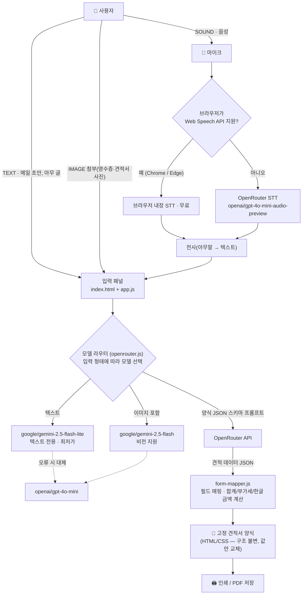

# 견적서 자동입력 AI (hwp-auto-input)

아무 글이나 음성을 전달하면 OpenRouter의 저가 AI 모델이 **고정된 견적서 양식**에 값을 채워 주는 정적 웹앱입니다. 서버·백엔드 없이 **HTML / CSS / JS**만 사용하며, 어떤 정적 호스팅에도 바로 배포할 수 있습니다.

## 아키텍처



- **브라우저 안**: 입력 패널 → STT → OpenRouter 호출 → JSON 파싱 → 고정 양식 렌더링
- **외부 AI(OpenRouter)**: 입력 형태에 따라 최저가 모델 자동 선택

### 모델 라우팅 (입력 형태별)

| 입력 형태 | 처리 | 모델 |
|---|---|---|
| 텍스트(메일 초안, 아무 글) | 직접 변환 | `google/gemini-2.5-flash-lite` (최저가) |
| 음성 (Chrome/Edge) | 브라우저 내장 STT → 텍스트 후 텍스트 모델 | 무료 |
| 음성 (미지원 브라우저) | 녹음 → OpenRouter 음성 모델 전사 | `openai/gpt-4o-mini-audio-preview` |
| 이미지 첨부 | 비전 모델 | `google/gemini-2.5-flash` |
| 자동 모드 오류 시 | 대체 모델 | `openai/gpt-4o-mini` |

드롭다운에서 모델을 수동 고정할 수도 있습니다.

## 고정 양식 보장 원리

- 견적서 **구조는 `index.html`의 `<article class="sheet">`에 하드코딩**되어 있고, AI는 오직 아래 JSON 스키마의 **값만** 반환합니다.

```json
{
  "docNumber": "", "issueDate": "2026-09-10",
  "clientName": "홍길동 팀장", "validUntil": "발행일로부터 7일",
  "supplierBizNo": "123-45-67890", "supplierCeo": "김한빛",
  "supplierCompany": "(주)한빛테크", "supplierAddress": "서울시 강남구…",
  "supplierPhone": "02-9876-5432", "supplierBizType": "서비스", "supplierBizItem": "인쇄·디자인",
  "items": [{ "name": "전단지", "spec": "a4", "qty": 5, "unit": "개", "unitPrice": 50000, "note": "" }],
  "taxIncluded": false,
  "account": "국민은행 123-456-789012", "manager": "이준호", "notes": ""
}
```

- 공급가액 합계 · 세액(VAT 10%) · 합계(부가세 포함) · `일금 ○○만○천원 정` · `₩ 합계`는 **JS가 직접 계산**하므로 AI 계산 오류가 결과에 반영되지 않습니다.
- 부가세 포함 금액을 말하면(`taxIncluded: true`) 시스템이 공급가액으로 자동 환산합니다.
- 품목은 항상 20행(부족하면 빈 행)으로 렌더링되어 양식이 변하지 않습니다.

## 실행 방법

1. `index.html`을 브라우저(Chrome/Edge 권장)로 열기
2. ⚙ 설정에서 OpenRouter API 키 저장 ([keys 발급](https://openrouter.ai/keys))
3. 텍스트 입력 또는 🎤 말하기 → ✨ 견적서로 변환

> 🎤 실시간 음성 인식(Web Speech API)은 `https://` 또는 `localhost`에서만 동작합니다. 로컬 테스트 시:
> ```bash
> npx http-server -p 8080
> ```
> 후 `http://localhost:8080` 접속. (미지원 브라우저는 OpenRouter 음성 모델로 자동 전환)

- **예시 채우기**: API 키 없이 양식/인쇄 상태를 확인할 수 있는 데모 데이터
- **인쇄 / PDF**: 견적서 양식만 A4로 출력 (입력 패널 제외)

## 배포 (정적 호스팅)

빌드 과정이 없으므로 폴더 전체를 업로드하는 것만으로 배포됩니다.

| 방법 | 절차 |
|---|---|
| GitHub Pages | 저장소 푸시 → Settings ▸ Pages ▸ 브랜치 선택 |
| Netlify | 폴더 드래그 앤 드롭 |
| Cloudflare Pages | 빌드 명령 없음, 출력 디렉터리 `/` |

API 키는 각 방문자가 자신의 키를 입력하는 구조이며 서버로 전송되지 않습니다(브라우저 localStorage에만 저장). 공개 배포 시 자신의 키를 코드에 심지 마세요.

## 파일 구조

```
hwp-auto-input/
├── index.html          # 고정 견적서 양식 + 입력 패널 (양식 구조는 여기에 고정)
├── css/style.css       # 양식 스타일 + A4 인쇄 대응
└── js/
    ├── form-mapper.js  # JSON → 양식 매핑, 합계/부가세/한글금액 계산
    ├── openrouter.js   # OpenRouter 클라이언트, 모델 라우터, 음성 전사
    ├── speech.js       # Web Speech API 실시간 음성 인식
    └── app.js          # 화면 제어, 설정(키 저장), 인쇄/예시/초기화
```

## 커스터마이징

- 양식 문구·행 수·항목 추가: `index.html`의 `data-field` 요소와 `js/form-mapper.js`의 `EDITABLE` 배열만 수정하면 됩니다. AI 스키마(`js/openrouter.js`의 `SYSTEM_PROMPT`)도 함께 맞춰 주세요.
- 모델 교체: `js/openrouter.js` 상단 `MODELS` 객체.
